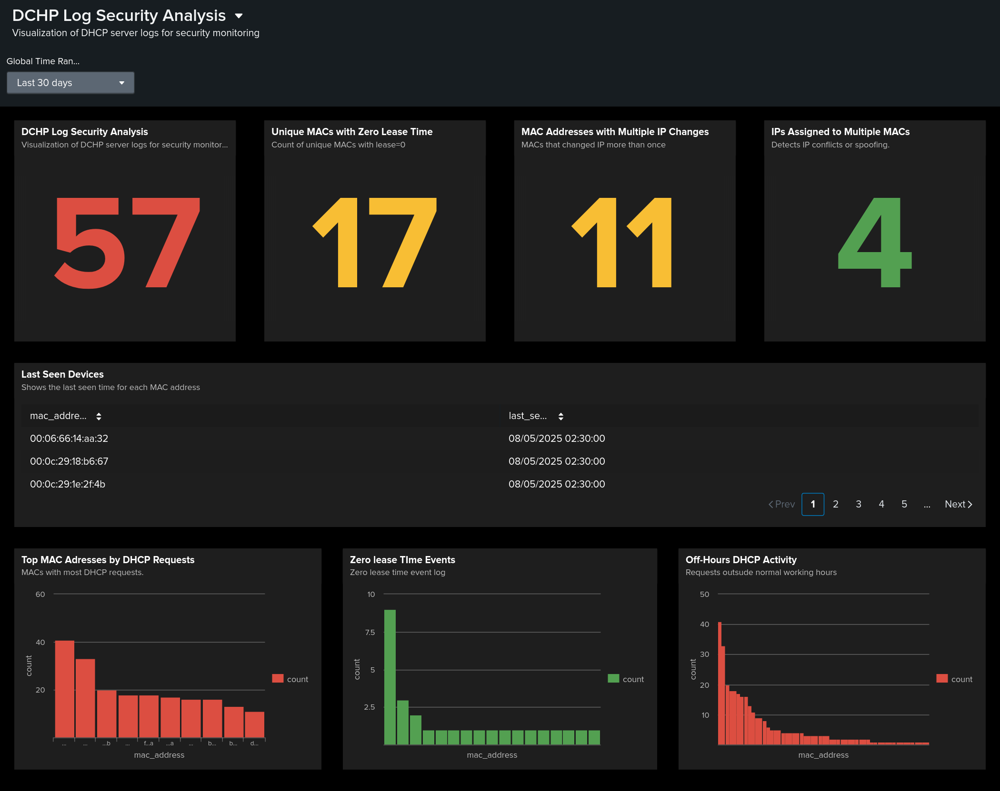

DHCP Log Analysis in Splunk
**Author:** Vlassov Vladislav  

> Full report with screenshots and detailed analysis available here:  
> **[report_doc.docx](report_doc.docx)**
> 
This Splunk dashboard is designed for monitoring and analyzing DHCP server logs to detect anomalies, improve network stability, and strengthen security posture.
It visualizes key metrics over the selected time range, helping to quickly identify:

Number of MAC addresses with zero lease time (lease_time = 0)

Number of MAC addresses that changed IP more than once

Number of IPs assigned to multiple MAC addresses

Total DHCP events count

Last seen devices in the network

Top MAC addresses by DHCP request count

DHCP activity outside normal working hours
- 

---

##  Project Objective  
Showcase practical SOC analyst skills in Splunk: ingesting and analyzing DHCP logs, detecting anomalies, and providing conclusions to improve network stability and security posture.

---

##  What’s Inside the Report (DOCX)  
- Case background and scenario description.  
- Clear sections for each analysis type.  
- Splunk panels, tables, and charts as screenshots.  
- Result interpretation: what it means for security and operations.  
- Conclusions for each analysis.  

---

##  Performed Checks and Conclusions  

### 1) Top MAC Addresses by DHCP Request Volume  
**Purpose:** Identify devices with the highest activity to detect “noisy” or unstable hosts.  
**Conclusion:** Certain MAC addresses showed significantly higher request counts. While this can be normal under heavy workloads, it may also indicate network loops, unstable links, or misconfigured clients.  
**Action Insight:** Consider monitoring these devices with request rate thresholds.

---

### 2) Single IP Assigned to Multiple MACs (Conflicts)  
**Purpose:** Detect address assignment issues and potential spoofing attempts.  
**Conclusion:** Found instances where one IP was linked to several MAC addresses. This usually signals DHCP/ARP misconfiguration or malicious actions.  
**Action Insight:** Investigate the source of these conflicts and review DHCP/ARP controls.

---

### 3) Zero Lease Time Sessions (lease_time = 0)  
**Purpose:** Identify issues in DHCP lease assignments.  
**Conclusion:** Detected events with zero lease time — an indicator of DHCP handshake failures or client/server misconfigurations.  
**Action Insight:** Review DHCP server logs and client configurations to prevent recurring issues.

---

### 4) Frequent IP Changes by the Same MAC  
**Purpose:** Highlight devices with abnormal IP change frequency.  
**Conclusion:** Several hosts changed IP addresses more than expected. While normal for mobile/guest devices, it can be suspicious for stationary assets.  
**Action Insight:** Review lease-time policy and investigate network stability for affected devices.

---

### 5) MAC Addresses with Excessive DHCP Requests  
**Purpose:** Detect possible DHCP DoS attacks or misbehaving clients.  
**Conclusion:** Identified devices with abnormally high DHCP request counts.  
**Action Insight:** Implement rate-based alerts and investigate the devices generating excessive traffic.

---

### 6) DHCP Requests Outside Business Hours  
**Purpose:** Detect unusual activity patterns during off-hours.  
**Conclusion:** Some devices requested IPs during nighttime. This might be scheduled automation or signs of compromised hosts.  
**Action Insight:** Correlate with known maintenance schedules; if not matching, investigate further.

---

### 7) MAC Addresses Inactive for Over 24 Hours  
**Purpose:** Identify devices that have left the network or become inactive.  
**Conclusion:** List of devices without lease renewal for over a day, useful for asset inventory cleanup and monitoring noise reduction.  
**Action Insight:** Cross-check with asset lists to confirm device status.

---

##  Overall Observations  
- A small group of hosts generated high DHCP load and should be monitored.  
- Signs of IP conflicts suggest potential configuration errors or malicious activity.  
- Off-hours DHCP activity requires validation against operational schedules.  
- Some clients operate with lease_time=0, pointing to service or client-side misconfigurations.  
- Inactive devices present an opportunity for inventory optimization and reducing monitoring noise.

---

##  How to Read This Project  
- All visual materials and detailed explanations are located in the document:  
  **[report_doc.docx](report_doc.docx)**  
